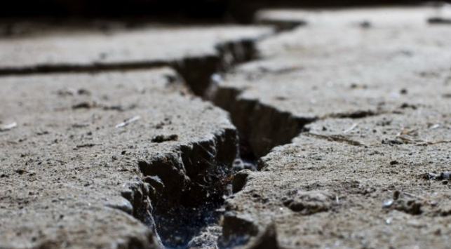

# Projet d'ETL via l'API d'enregistrement des tremblements de terre



## Contexte :

Pour ce mini-projet, j'ai décidé de requêter l'[API](https://earthquake.usgs.gov/fdsnws/event/1/) du gouverment américain afin de tester l'aspect planification d'Apache Airflow. En effet, l'ETL viendra requêter l'API toutes les minutes et stockera les informations qui n'ont pas encore été stockées dans une base de donnée MongoDB locale. La fonction de purge, quant à elle, viendra automatiquement purger les données qui sont plus anciennes avec les paramètres convenus.

## Prérequis :

* Un [environnement virtuel](https://docs.python.org/3/library/venv.html)
* Une configuration [Apache Airflow](https://airflow.apache.org/)
* Une configuration [MongoDB](https://www.mongodb.com/)

## Structure :

Le projet est, comme précédemment décrit, structuré en deux DAGs (workflows) :
* Un [DAG d'ETL](https://github.com/Aubin65/earthquake_etl/blob/main/DAGs/etl.py)
* Un [DAG de purge](https://github.com/Aubin65/earthquake_etl/blob/main/DAGs/purge.py)

## ETL :

Comme décrit précédemment, l'ETL va venir requêter l'[API](https://earthquake.usgs.gov/fdsnws/event/1/) du gouverment américain pour récupérer les données dont nous avons besoin.

Les données sont stockées sous la forme suivante dans la base de données MongoDB :

```json
{
  "_id": "ObjectId('674597b629fb05cd930292bf')",
  "mag": 1.32,
  "place": "9 km NW of The Geysers, CA",
  "date": "2024-11-26T09:21:32",
  "type": "earthquake",
  "nst": 27,
  "dmin": 0.007061,
  "sig": 27,
  "magType": "md",
  "geometryType": "Point",
  "longitude": -122.842666625977,
  "latitude": 38.8193321228027,
  "depth": 2.46000003814697
}
```

Les seules transformations effectuées sont :
* Une sélection spécifique des données
* Un changement du format de la date : timestamp -> UTC
* Une séparation des différents composants de la géolocalisation

## Purge :

L'un des défis pour ne pas surcharger ni la base de données, ni les visuels, est de ne pas récupérer l'historique des données mais seulement une journée de données. Pour cela, nous récupérons les données lorsqu'elles apparaissent, puis nous purgeons celles qui sont plus anciennes que la veille à la même heure.

La visée de ce projet est d'avoir une base de données recueillant seulement les données très récentes sur les tremblements de terre. D'autres utilisations de l'API pourraient mener à des rapports historiques concernant les statistiques collectées mais ce n'est pas le but de ce projet de test.

## Approfondissement du projet :

Pour approfondir ce projet de data engineering, voici deux pistes potentielles : 
* Ajouter d'autres collections qui sont en lien avec celle déjà présente
* Par conséquent ajouter d'autres sources de données pour complexifier la pipeline