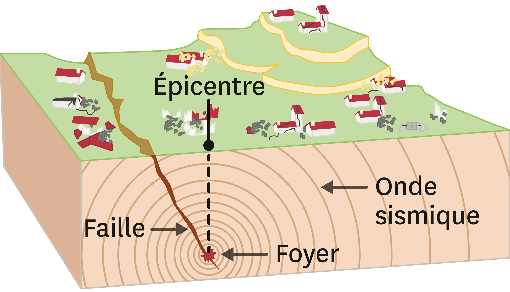
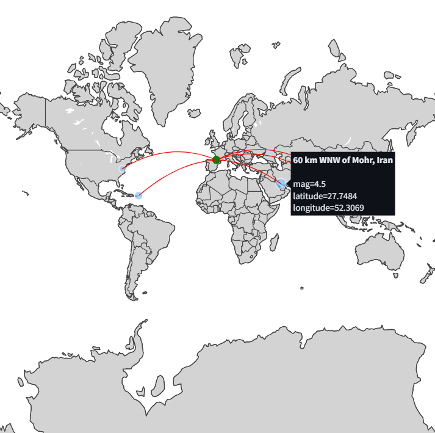

# Projet d'ETL via l'API d'enregistrement des tremblements de terre



## Contexte :

Pour ce mini-projet, j'ai décidé de requêter l'[API](https://earthquake.usgs.gov/fdsnws/event/1/) du gouverment américain afin de tester l'aspect planification d'Apache Airflow. En effet, l'ETL viendra requêter l'API toutes les minutes et stockera les informations qui n'ont pas encore été stockées dans une base de donnée MongoDB locale. La fonction de purge, quant à elle, viendra automatiquement purger les données qui sont plus anciennes avec les paramètres convenus. Un troisième flow servira à alerter une liste de mails lorsque des séismes apparaissent trop proches de notre position (nous prendrons arbitrairement Orthez)

## Prérequis :

* Un [environnement virtuel](https://docs.python.org/3/library/venv.html)
* Une configuration [Apache Airflow](https://airflow.apache.org/)
  * Cela implique la configuration du fichier airflow.cfg comme décrit dans le [script de chargement des variables d'environnement](https://github.com/Aubin65/earthquake_etl_airflow/blob/main/load_environment_variables/load_environment_variables.py)
* Une configuration [MongoDB](https://www.mongodb.com/)
* Une configuration de mail (Outlook ici mais fonctionne avec d'autres services)

## Structure :

Le projet est, comme précédemment décrit, structuré en deux DAGs (workflows) :
* Un [DAG d'ETL](https://github.com/Aubin65/earthquake_etl_airflow/blob/main/DAGs/etl.py)
* Un [DAG de purge](https://github.com/Aubin65/earthquake_etl_airflow/blob/main/DAGs/purge.py)
* Un [DAG d'alerte](https://github.com/Aubin65/earthquake_etl_airflow/blob/main/DAGs/alerting.py)

## ETL :

Comme décrit précédemment, l'ETL va venir requêter l'[API](https://earthquake.usgs.gov/fdsnws/event/1/) du gouverment américain pour récupérer les données dont nous avons besoin.

Les données sont stockées sous la forme suivante dans la base de données MongoDB :

```json
{
  "_id": "ObjectId('674597b629fb05cd930292bf')",
  "mag": 1.32,
  "place": "9 km NW of The Geysers, CA",
  "date": "2024-11-26T09:21:32",
  "type": "earthquake",
  "nst": 27,
  "dmin": 0.007061,
  "sig": 27,
  "magType": "md",
  "geometryType": "Point",
  "longitude": -122.842666625977,
  "latitude": 38.8193321228027,
  "depth": 2.46000003814697,
  "distance_from_us_km": 9194.42
}
```

Les seules transformations effectuées sont :
* Une sélection spécifique des données
* Un changement du format de la date : timestamp -> UTC
* Une séparation des différents composants de la géolocalisation
* L'ajout de l'attribut *distance_from_us_km* qui contient la distance entre l'épicentre du séisme et Orthez

J'ai ici utilisé la librairie **pymongo** de python mais j'aurais pu utiliser un **MongoHook** spécifique à Airflow.

## Purge :

L'un des défis pour ne pas surcharger ni la base de données, ni les visuels, est de ne pas récupérer l'historique des données mais seulement une journée de données. Pour cela, nous récupérons les données lorsqu'elles apparaissent, puis nous purgeons celles qui sont plus anciennes que la veille à la même heure.

La visée de ce projet est d'avoir une base de données recueillant seulement les données très récentes sur les tremblements de terre. D'autres utilisations de l'API pourraient mener à des rapports historiques concernant les statistiques collectées mais ce n'est pas le but de ce projet de test.

## Alerting :

Le troisième DAG a été mis en place pour alerter les personnes concernées lorsqu'un séisme a eu lieu lors des dernières 24 heures. Le DAG vient récupérer les enregistrements plus proches que la distance minimale déclarée (5000 km par défaut) puis envoie un mail avec leur contenu aux personnes déclarées dans le fichier *.env*.

Pour que ce DAG fonctionne, il faut donc créer ce fichier *.env* avec un contenu de la forme suivante : 

```
SMTP_HOST=smtp.office365.com
SMTP_USER=user@mail.com
SMTP_PASSWORD=pwd
SMTP_MAIL_FROM=source@mail.com
SMTP_RECIPIENTS=recipient1@mail.com,recipient2@mail.com
```

## Visualisation :

Il existe dans le répertoire [streamlit](https://github.com/Aubin65/earthquake_etl_airflow/tree/main/streamlit) un [fichier](https://github.com/Aubin65/earthquake_etl_airflow/blob/main/streamlit/streamlit.py) qui permet de visualiser ces tremblements de terre en fonction de leur magnitude. 

Pour lancer ce fichier, il faut se placer dans son répertoire et lancer la ligne de code suivante : 

```bash
streamlit run streamlit.py
```

Ce [dossier](https://github.com/Aubin65/earthquake_etl_airflow/tree/main/streamlit) contient les fonctions permettant la créations des visuels streamlit grâce aux librairies pandas et plotly. 

L'affichage est lui aussi divisé en deux parties : 
* Une partie concernant les tremblements de terre ayant eu lieu durant les 24 dernières heures avec filtre sur la magnitude
* Une partie concernant les n plus proches tremblements de terre parmi ceux précédemment cités

Les rendus sont de la forme suivante : 

<br>
<center>

<i>Tremblements de terre dans le monde lors des 24 dernières heures</i>
</center>
</br>

<br>
<center>

<i>n plus proches Tremblements de terre dans le monde lors des 24 dernières heures</i>
</center>
</br>

## Approfondissement du projet :

Pour approfondir ce projet de data engineering, voici deux pistes potentielles : 
* Ajouter d'autres collections qui sont en lien avec celle déjà présente
* Par conséquent ajouter d'autres sources de données pour complexifier la pipeline
* Ajouter un algorithme de clustering pour essayer de retrouver les [23 plaques tectoniques](https://www.notre-planete.info/terre/risques_naturels/seismes/plaques-tectoniques.php) sachant que l'on a leur coordonnées